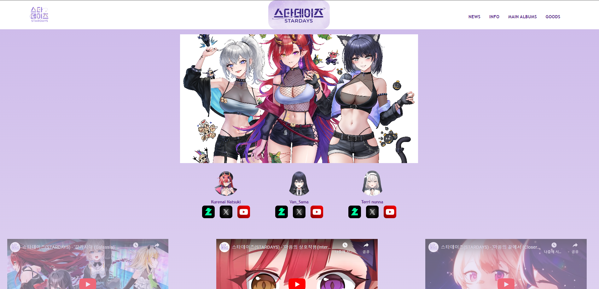
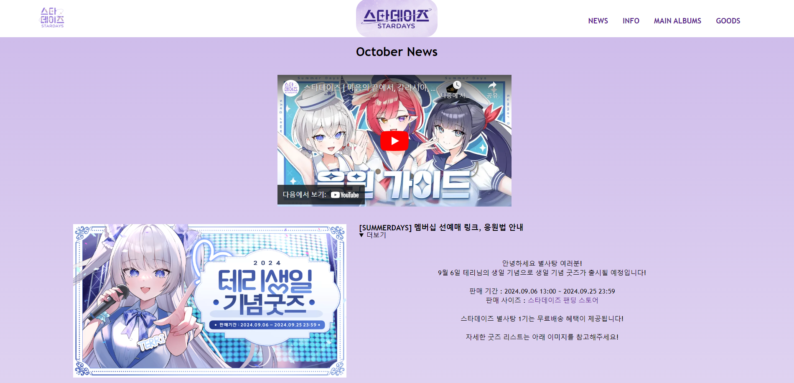
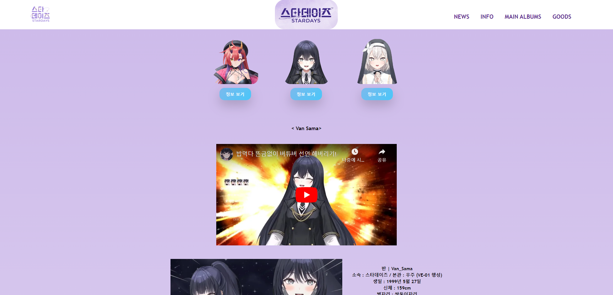
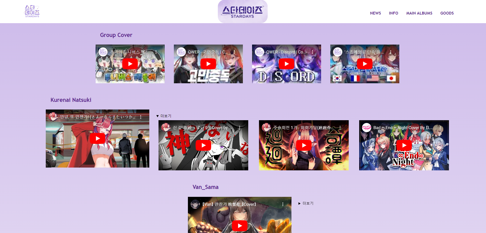

# Stardays Fansite
<!--프로젝트 메인 이미지-->

# 목차
<!--목차-->
- [Project](#project)
    - [Features](#features)
    - [Techniques](#techniques)
- [Page](#page)
    - [Main Page](#main-page)
    - [News Page](#news-page)
    - [Information Page](#information-page)
    - [Main Albums Page](#main-albums-page)
- [Contact](#contact)

<!--프로젝트 설명-->
## Project
- 해당 프로젝트는 방송인 그룹 **Stardays**의 Fan Site로 그룹의 최신 앨범 및 멤버별 SNS, Schedule, 매달 갱신되는 뉴스, 각 멤버별 정보, 최신 커버 및 노래을 포함합니다.
- Front에 대해 공부하며 사이트의 구조 및 디자인을 공부하기 위한 프로젝트 입니다.
- Goods 사이트의 경우 현재 사용되는 사이트로 연결하였습니다.

### Features
- 팬아트를 메인 이미지로 사용하였으며 멤버의 SNS, 그룹 최신 곡, Schedule을 확인할 수 있습니다.
- 매 월 갱신되는 공지사항을 확인할 수 있습니다.
- 멤버 별 정보, 밈에 대한 정보를 확인할 수 있습니다.
- 멤버 별 최신 커버 및 노래를 확인할 수 있습니다

### Techniques
- [HTML5], [CSS3], [JavaScript]
- [Visual Studio Code]

<!--각 페이지 설명-->
## Page

### Main Page

- **Main Page**입니다. 해당 페이지는 초기 로드 화면으로 팬아트와 멤버 별 SNS, 최신 그룹 커버곡, Schedule을 확인할 수 있습니다.
- 상단 좌측 로고와 중앙 로고를 통해 Main Page로 이동할 수 있습니다.

### News Page

- **News Page**입니다. 매 달 갱신되는 정보로 매 달 공지사항을 확인할 수 있습니다.
- 더보기를 통해 자세한 내용을 확인할 수 있습니다.

### Information page

- **Information Page**입니다. 멤버 사진 하단의 버튼을 통해 정보를 확인할 수 있습니다.
- 해당 멤버의 소개 영상과 함께 자세한 정보, 방송의 밈을 확인할 수 있습니다.

### Main Albums Page

-  **Main Albums Page**입니다. Group Cover 4곡을 확인할 수 있습니다.
- 각 멤버별 메인 1곡 더보기 4곡을 통해 총 5곡을 들을 수 있습니다.

<!--접근-->
## Contact
- 📧  **wodnd565@gmail.com**
- 📞  **010 - 5657 - 4813**
